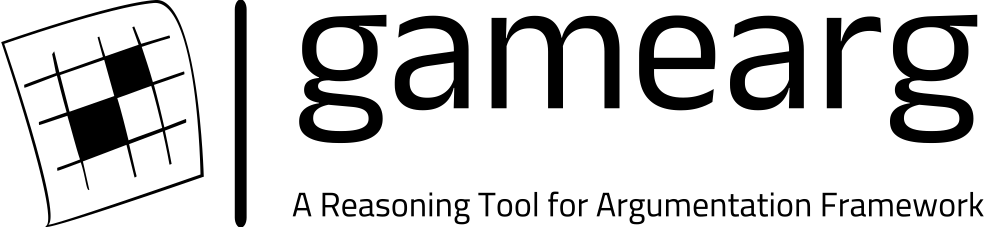

# GameArg
<p align="center">

</p>

A Reasoning Tool for Argumentation Framework powered by Logic Programming and Game Theory

## Running Locally
```
git clone git@github.com:idaks/gamearg.git
cd gamearg
conda env create -f environment.yaml
conda activate gamearg
```

## Codespace Setup
[](https://codespaces.new/idaks/Games-and-Argumentation)

To set up your environment, simply click on the `Open in GitHub Codespaces` button above. Once the environment setup is complete, you'll be presented with an online version of VScode.

> **Notice:** If you encounter alerts like "Container build failed. Check troubleshooting guide" or "This codespace is currently running in recovery mode due to a configuration error", don't panic. Just press `Ctrl+Shift+P` and type `>Codespaces: Full Rebuild Container` to resolve the issue.

This process will take around 4-8 minutes. **Please do not** press any button until you see something like: `@username  ➜ /workspaces/Games-and-Argumentation (main) $ `

#### For Non-First-Time Usage
You can find the codespace you created at [this link](https://github.com/codespaces).

### Launch Jupyter

After setting up the codespace environment:

1. Type `jupyter lab` in the Terminal of the VScode online version.
   
   > **Notice:** Sometimes, due to codespace limitations, the terminal may go blank. Simply refreshing your browser should solve the problem.

2. This will lead you to the Jupyter Lab interface, where you can run:
   - `Tutorial.ipynb`

## Developer Installation
```
conda create --name gamearg pip python=3.10
conda activate gamearg
```

## Check out our papers
Ludäscher, B., & Xia, Y. (2023). [Games and Argumentation: Time for a Family Reunion!](https://arxiv.org/pdf/2309.06620.pdf). arXiv preprint arXiv:2309.06620.

Ludäscher, B., Bowers, S., & Xia, Y. (2023). [Games, Queries, and Argumentation Frameworks: Time for a Family Reunion!](https://ceur-ws.org/Vol-3546/paper06.pdf).
In CEUR Workshop Proceedings (Vol. 3546). CEUR-WS.

## License
The software is available under the MIT License.

## Contact
For any queries, please open an issue on GitHub or contact [Yilin Xia](https://yilinxia.com/)

